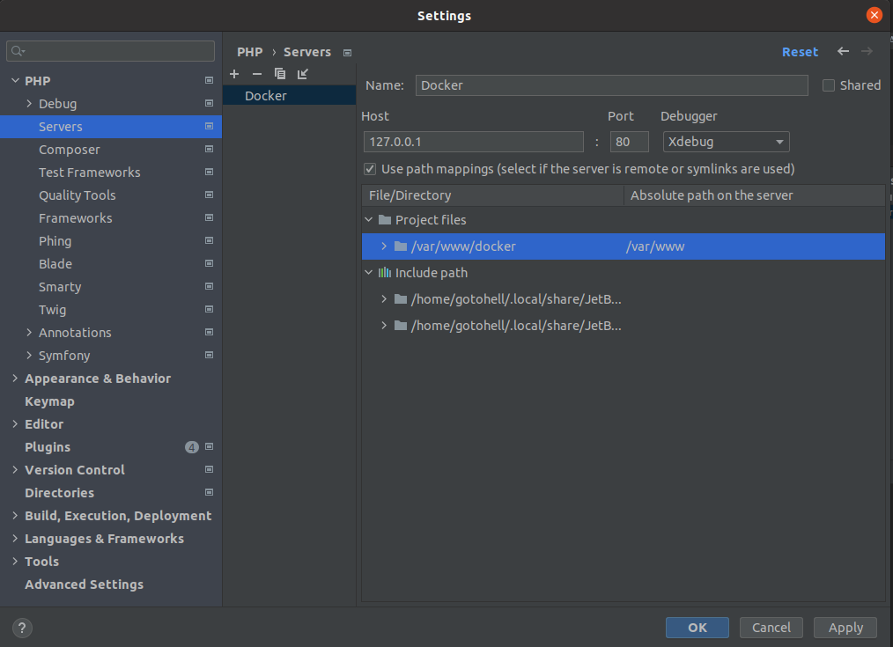

# Docker-PHP8-XDebug-NGINX-pgSQL

1. Запускаем команду `make init`. Контейнеры должны запустится.
2. Установка Symfony
   1. `composer create-project symfony/skeleton:"6.1.*" app`
   2. `mv app/*(D) .`
   3. `rmdir app`
3. В `.env` прописываем для `DATABASE_URL` хост, который называется `postgres`

## Установка XDebug
1. Создаем сервер и прокидываем пути 
2. Ставим breakpoint и можно проверить с помощью курла `curl 127.0.0.1:80`